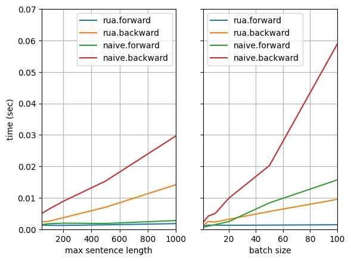

# TorchRua

*Rua* derives from the Szechwanese character <ruby>挼<rt>ruá</rt></ruby> which means "pack, rumple, screw up, manipulate". TorchRua provides tons of easy-to-use functions to help you rua variable-length Tensors with `PackedSequence`!

## Requirements

- Python3.7 or higher
- PyTorch 1.6.0

## Performance

* `reverse_packed_sequence`: O(1) forward and O(n) backward with much smaller constant factor than naive implementation.

  

